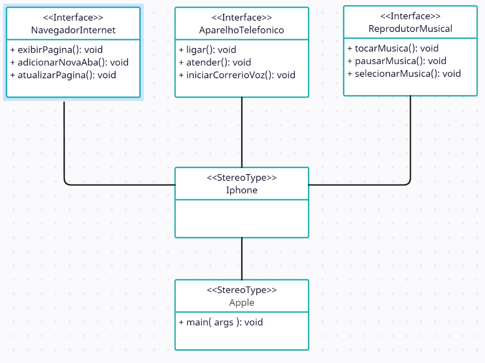

# Projeto iPhone

Este projeto consiste na modelagem e implementação em Java das funcionalidades de um iPhone, incluindo Reprodutor Musical, Aparelho Telefônico e Navegador na Internet.

## Estrutura UML

## Funcionalidades

### Reprodutor Musical
- Tocar
- Pausar
- Selecionar Música

### Aparelho Telefônico
- Ligar
- Atender
- Iniciar Correio de Voz

### Navegador na Internet
- Exibir Página
- Adicionar Nova Aba
- Atualizar Página

## Estrutura do Projeto

O projeto está organizado em classes e interfaces Java, conforme a seguir:

- `ReprodutorMusical.java`: Interface que define as operações do Reprodutor Musical.
- `AparelhoTelefonico.java`: Interface que define as operações do Aparelho Telefônico.
- `NavegadorInternet.java`: Interface que define as operações do Navegador na Internet.
- `iPhone.java`: Classe que implementa as interfaces acima e representa o iPhone.
- `Apple.java`: Classe main que executa todas as funcionalidades.

## Autor
Este programa foi desenvolvido por Jesimiel Silva.

## Iniciativa
DIO - Digital Innovation One. Visite [Meu Perfil](https://www.dio.me/users/jesimielbarbosa/).
